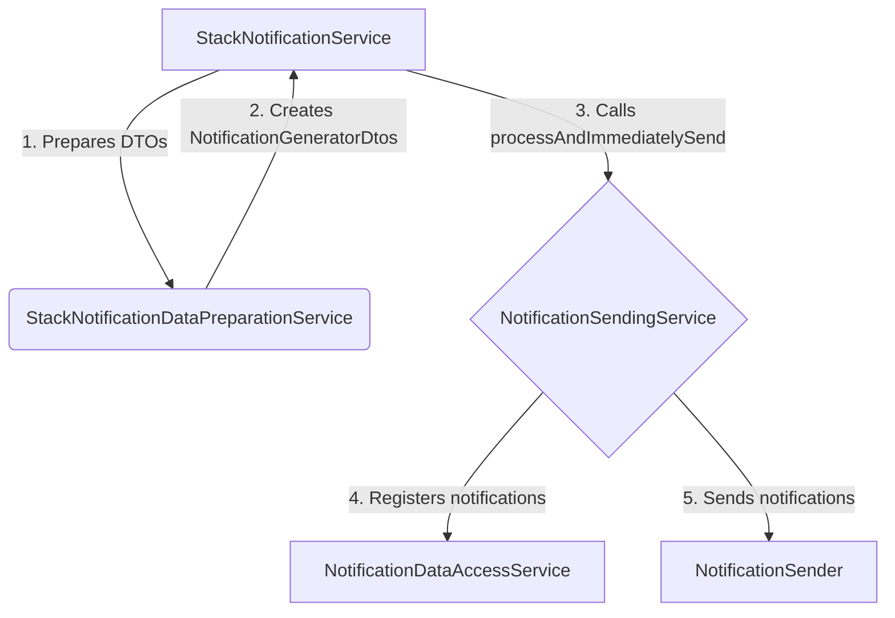

# How to create a new email notification

This document describes the steps to create a new email notification using the `NotificationSendingService`.

The notification sending process is designed to be flexible and extensible. It allows you to define custom notification types, generate notification messages from your own data structures, and handle the results of the notification sending process in a customized way. A good real-world example of this is the `StackNotificationService`, which sends notifications about stack status changes.

## Notification Sending Flow

The following diagram illustrates the flow of sending a stack status notification:



## Steps

### 1. Prepare Notification Data

Instead of creating a DTO directly, it's a good practice to have a dedicated service for preparing notification data. In our example, `StackNotificationDataPreparationService` is responsible for creating `NotificationGeneratorDtos` from a `Stack` object.

This service will create the appropriate DTO and wrap it in `NotificationGeneratorDtos` along with the `NotificationType`.

### 2. Implement a new notification generator

Next, you need to create a notification generator that will transform your DTO into a notification message. This is done by implementing the `NotificationContentGenerator` interface. For stack status changes, there are generators that create email subjects and bodies.

### 3. Call `processAndImmediatelySend` from a service

Finally, a service like `StackNotificationService` orchestrates the process. It calls the data preparation service and then sends the notification using `NotificationSendingService`.

**Example from `StackNotificationService`:**

```java
@Service
public class StackNotificationService {

    // ... dependencies injected ...

    private Future<Boolean> sendNotification(Stack stack, Status newStatus,
        DetailedStackStatus newDetailedStatus, String statusReason, String accountId) throws TransactionService.TransactionExecutionException {
        return intermediateBuilderExecutor.submit(() -> {
            try {
                // ... other logic ...

                NotificationGeneratorDtos notificationGeneratorDtos = stackNotificationDataPreparetionService
                        .notificationGeneratorDtos(stack, newStatus, newDetailedStatus, statusReason, accountId);

                notificationSendingService.processAndImmediatelySend(notificationGeneratorDtos);
                return true;
            } catch (Exception e) {
                LOGGER.error("Notification could not be sent for cluster {} because {}.", stack.getName(), e.getMessage(), e);
                throw e;
            }
        });
    }

    // ...
}
```

This example shows how `StackNotificationService` uses `stackNotificationDataPreparetionService` to get the `NotificationGeneratorDtos` and then calls `processAndImmediatelySend` on `notificationSendingService` to send the notification. If you need to handle the result of the sending process (e.g., to know which recipients received the notification), you can use the `processAndImmediatelySendWithCallback` method instead.
