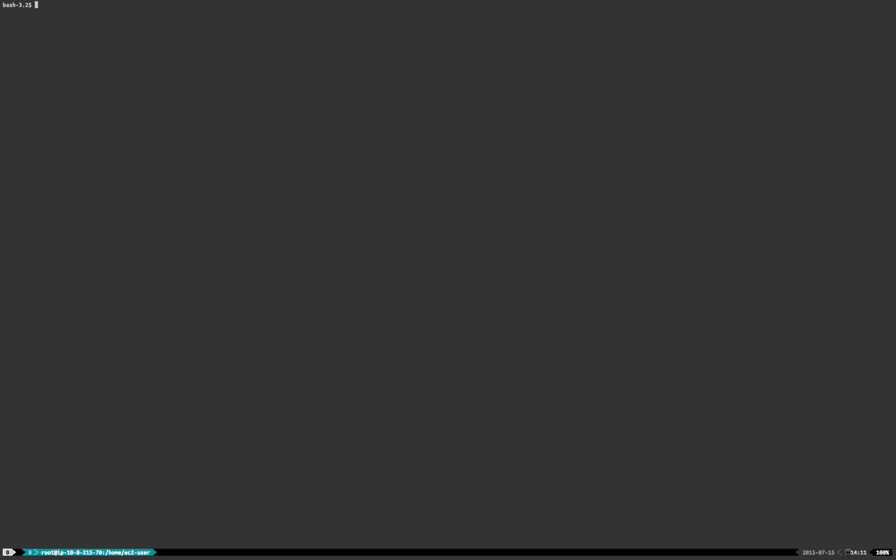

## Cloudbreak Shell

The goal with the CLI was to provide an interactive command line tool which supports:

* all functionality available through the REST API or Cloudbreak Web UI
* makes possible complete automation of management task via **scripts**
* context aware command availability
* tab completion
* required/optional parameter support
* **hint** command to guide you on the usual path

## Install Cloudbreak Shell

You have 3 options to give it a try:

- use our prepared [docker image](https://github.com/sequenceiq/docker-cb-shell) - **recommended** solution
- download the latest self-containing executable jar from our maven repo with the ./latest-release.sh file
- build it from source

### Build from source

If want to use the code or extend it with new commands follow the steps below. You will need:
- jdk 1.7

```
git clone https://github.com/sequenceiq/cloudbreak-shell.git
cd cloudbreak-shell
./gradlew clean build
```

_Note: In case you use the hosted version of Cloudbreak you should use the `latest-release.sh` to get the right version of the CLI._

<!--more-->

## Sign in and connect to Cloudbreak

There are several different ways to use the shell. First of all you'll need a Cloudbreak instance you can connect to. The easiest way is to use our hosted solution - you can access it with your SequenceIQ credentials. If you don't have an account, you can subscribe [here](https://accounts.sequenceiq.com/register).

Alternatively you can host your own Cloudbreak instance - for that just follow up with the steps in the Cloudbreak [documentation](http://sequenceiq.com/cloudbreak/#quickstart-and-installation). If you're hosting your own Cloudbreak server you can still use your SequenceIQ credentials and our identity server, but then you'll have to configure your Cloudbreak installation with proper client credentials that will be accepted by our identity server. It is currently not supported to register your Cloudbreak application through an API (but it is planned), so contact us if you'd like to use this solution.

The third alternative is to deploy our whole stack locally in your organization with [cloudbreak-deployer](https://github.com/sequenceiq/cloudbreak-deployer).

Please feel free to create bugs, ask for enhancements or just give us feedback by either using our [GitHub repository](https://github.com/sequenceiq/cloudbreak) or the other channels highlighted in the product documentation (Google Groups, email or social channels).

The shell is built as a single executable jar with the help of [Spring Boot](http://projects.spring.io/spring-boot/).

```
Usage:
  java -jar cloudbreak-shell-0.5-SNAPSHOT.jar                  : Starts Cloudbreak Shell in interactive mode.
  java -jar cloudbreak-shell-0.5-SNAPSHOT.jar --cmdfile=<FILE> : Cloudbreak executes commands read from the file.

Options:
  --cloudbreak.address=<http[s]://HOSTNAME:PORT>  Address of the Cloudbreak Server [default: https://cloudbreak-api.sequenceiq.com].
  --identity.address=<http[s]://HOSTNAME:PORT>    Address of the SequenceIQ identity server [default: https://identity.sequenceiq.com].
  --sequenceiq.user=<USER>                        Username of the SequenceIQ user [default: user@sequenceiq.com].
  --sequenceiq.password=<PASSWORD>                Password of the SequenceIQ user [default: password].

Note:
  You should specify at least your username and password.
```
Once you are connected you can start to create a cluster. If you are lost and need guidance through the process you can use `hint`. You can always use `TAB` for completion. Note that all commands are `context aware` - they are available only when it makes sense - this way you are never confused and guided by the system on the right path.

### Create a cloud credential

In order to start using Cloudbreak you will need to have a cloud user. The synthax will vary depending on the target cloud service provider but the logic is similar. Note that Cloudbreak **does not** store you cloud user details - we work around the concept of [IAM](http://aws.amazon.com/iam/) - on Amazon (or other cloud providers) you will have to create an IAM role, a policy and associate that with your Cloudbreak account - for further documentation please refer to the [documentation](http://sequenceiq.com/cloudbreak/#accounts).

#### Amazon AWS example

```
credential create --EC2 --description "description" --name "myCredentialName" --roleArn "arn:aws:iam::NUMBER:role/cloudbreak-ABC" --sshKeyUrl "URL towards your public SSH key file"
```

Other available options:

- --sshKeyPath "path": upload your public key from a file (replaces --sshKeyUrl)

- --publicInAccount "flag": flags if the credential is public in the account

#### Google Cloud Platform example

```
credential create --GCP --description "description" --name "myCredentialName" --projectId "myProjectId" --serviceAccountId "myServiceAccoundId" --serviceAccountPrivateKeyPath "path of a service account private key (p12) file" --sshKeyUrl "URL towards your public SSH key file"
```

Other available options:

- --sshKeyPath "path": upload your public key from a file (replaces --sshKeyUrl)

- --publicInAccount "flag": flags if the credential is public in the account

#### Openstack example

```
credential create --OPENSTACK --description "description" --name "myCredentialName" --userName "myUsername" --password "myPassword" --tenantName "myTenantName" --endPoint "myEndPoint" --sshKeyUrl "URL towards your public SSH key file"
```

Other available options:

- --sshKeyPath "path": upload your public key from a file (replaces --sshKeyUrl)

- --publicInAccount "flag": flags if the credential is public in the account

#### Azure Resource Manager example

```
credential create --AZURE --description "description" --name "myCredentialName" --subscriptionId "mySubscriptionId" --tenantId "sdfsd-sdfdsf-dsfdsf-sdfsdf" --appId "sdfdsfs-sdfsddsf-sdfsdf-sdfsdf" --password "acceskey" --sshKeyUrl "URL towards your public SSH key file"
```

**You can use your Azure templates and networks under the stack creation (No need to create new templates and networks !!!)**

Other available options:

- --sshKeyPath "path": upload your public key from a file (replaces --sshKeyUrl)

- --publicInAccount "flag": flags if the credential is public in the account

#### Checking credential creation

You can check whether the credential was creates successfully by using the `credential list` command. You can (and probably want to use the new credential if automating tasks) switch between your cloud credential - when you’d like to use one and act with that you will have to use:

```
credential select --id <ID of the credential>
```
or
```
credential select --name <Name of the credential>
```

### Create a template

A template gives developers and systems administrators an easy way to create and manage a collection of cloud infrastructure related resources, maintaining and updating them in an orderly and predictable fashion. A template can be used repeatedly to create identical copies of the same stack (or to use as a foundation to start a new stack).

#### Amazon AWS example

```
template create --EC2 --name awstemplate --description aws-template --instanceType M3Xlarge --volumeSize 100 --volumeCount 2
```

Other available options:

- --volumeType "voltype": defaults to "gp2", other allowed value: "io1" or "standard"

- --encrypted "boolean": use encrypted disks

- --spotPrice "double": amount you're willing to pay for resources

- --sshLocation "CIDR": defaults to 0.0.0.0/0

- --publicInAccount "flag": flags if the template is public in the account

#### Google Cloud Platform example

```
template create --GCP --name gcptemplate --description gcp-template --instanceType N1_STANDARD_4 --volumeSize 100 --volumeCount 2
```

Other available options:

- --volumeType "voltype": defaults to "HDD", other allowed value: "SSD"

- --publicInAccount "flag": flags if the template is public in the account

#### Openstack example

```
template create --OPENSTACK --name openstacktemplate --description openstack-template --instanceType "type" --volumeSize 100 --volumeCount 2
```

Other available options:

- --publicInAccount "flag": flags if the template is public in the account

#### Azure example

```
template create --AZURE --name azuretemplate --description azure-template --instanceType STANDARD_D2 --volumeSize 100 --volumeCount 2
```

Other available options:

- --publicInAccount "flag": flags if the template is public in the account


#### Viewing created template

You can check whether the template was created successfully by using the `template list` command. Check the template and select it if you are happy with it:

```
template show --id <ID of the template>
```
or
```
template show --name <Name of the template>
```

### Create a network

A network gives developers and systems administrators an easy way to create and manage a collection of cloud infrastructure related networking, maintaining and updating them in an orderly and predictable fashion. A network can be used repeatedly to create identical copies of the same stack (or to use as a foundation to start a new stack).

#### Amazon AWS example

```
network create --EC2 --name awsnetwork --description aws-network --subnet 0.0.0.0
```

Other available options:

- --vpcID "string": your existing vpc on amazon

- --internetGatewayID "string": your amazon internet gateway

- --publicInAccount "flag": flags if the network is public in the account

#### Google Cloud Platform example

```
network create --GCP --name gcpnetwork --description gcp-network --subnet 0.0.0.0
```

Other available options:

- --publicInAccount "flag": flags if the network is public in the account

#### Openstack example

```
network create --OPENSTACK --name openstacknetwork --description openstack-network --publicNetID "324234-32423423-23423423-23423432" --subnet 0.0.0.0
```

#### Azure example

```
network create --AZURE --name azurenetwork --description azure-network --addressPrefix 192.168.123.123 --subnet 0.0.0.0
```

Other available options:

- --publicInAccount "flag": flags if the template is public in the account

#### Viewing created network

You can check whether the network was created successfully by using the `network list` command. Check the network and select it if you are happy with it:

```
network show --id <ID of the network>
```
or
```
network show --name <Name of the network>
```

#### Select a network

You can select one of the created network with

```
network select --id <ID of the network>
```
or
```
network select --name <Name of the network>
```

### Create a security group

A security group gives developers and systems administrators an easy way to create and manage a collection of cloud infrastructure related security rules, maintaining and updating them in an orderly and predictable fashion. A security group can be used repeatedly to create identical copies of the same stack (or to use as a foundation to start a new stack).

#### Security group creation example

```
securitygroup create --name secgroup_example --description securitygroup-example --rules 0.0.0.0/0:tcp:8080,9090;10.0.33.0/24:tcp:1234,1235
```

#### Viewing created security group

You can check whether the security group was created successfully by using the `securitygroup list` command. Check the security group and select it if you are happy with it:

```
securitygroup show --id <ID of the security group>
```
or
```
securitygroup show --name <Name of the security group>
```

#### Select a security group

You can select one of the created network with

```
securitygroup select --id <ID of the security group>
```
or
```
securitygroup select --name <Name of the security group>
```

### Configure an instance groups

You have to configure the instancegroups before the provisioning. An instancegroup is defining a group of your nodes with a specified templates.

```
instancegroup configure --instanceGroup slave_1 --nodecount 1 --templateId 51
```

Other available options:

- --templateName "string": Name of the template

### Configure a host groups

You have to configure the host groups before the provisioning(by default the cloudbreak shell doing it automatically). A host group is defining a host group in you ambari cluster.

```
hostgroup configure --hostgroup slave_1 --recipeIds 1,2,3
```

Other available option:

- --recipeNames "string": comma separated list of recipe names

### Configure a recipe

You can create recipes for automate your setups before ambari install or after ambari install.

```
recipe add --url "https://raw.githubusercontent.com/sequenceiq/consul-plugins-titan/master/titan-recipe.json"
```

Other available options:

- --file "string": the file which contains the recipe
- --publicInAccount "flag": flags if the template is public in the account

### Create and store custom recipe

You can create and store your custom recipe in Cloudbreak. Name and executionType is mandatory and at least one script file, which exists.

```
recipe store --name "my_recipe" --executionType (ONE_NODE|ALL_NODES) --preInstallScriptFile /path/of/the/pre-install-script --postInstallScriptFile /path/of/the/post-install-script
```

Other available options:

- --description "string": description of the recipe
- --timeout "integer": Timeout of the script execution
- --publicInAccount "flag": flags if the template is public in the account

### Select a blueprint

We ship default Hadoop cluster blueprints with Cloudbreak. You can use these blueprints or add yours. To see the available blueprints and use one of them please use:

```
blueprint list
```
then select one of the created blueprints

```
blueprint select --id <ID of the blueprint>
```
or
```
blueprint select --name <Name of the blueprint>
```

### Create a stack

Stack means the running cloud infrastructure that is created based on the instance groups configured earlier. Use the following command to create a stack to be used with your Hadoop cluster:

```
stack create --name myStackName --region EU_WEST_1
```

Other available options:

- --image "string": the specific image which is used during provisioning
- --onFailureAction "string": the available values are DO_NOTHING or ROLLBACK
- --adjustmentType "string": the available values are EXACT or PERCENTAGE
- --threshold "long": the number for the adjustmentType
- --diskPerStorage "integer": the number of disks in one storage (only for AZURE)
- --dedicatedInstances "flags": indicates using dedicated instances (only for AWS)
- --publicInAccount "flag": flags if the template is public in the account

The infrastructure is created asynchronously, the state of the stack can be checked with the `stack show` command. If it reports *AVAILABLE*, it means that the virtual machines and the corresponding infrastructure is running at the cloud provider.

### Stopping and restarting a stack

After a stack is created, its virtual machines can be stopped by running:
```
stack stop
```

A stopped stack can be restarted with:
```
stack start
```

### Upscaling and downscaling a stack

```
stack node --ADD --instanceGroup slave_1 --adjustment 2
```
Other available options:

- --withClusterUpScale "flag": indicates cluster upscale after stack upscale

or
```
stack node --REMOVE  --instanceGroup slave_1 --adjustment -2
```


### Create a Hadoop cluster
You are almost done - one more command and this will create your Hadoop cluster on your favorite cloud provider. Same as the API, or UI this will use your `template`, and by using CloudFormation will launch a cloud `stack` - once the `stack` is up and running (cloud provisioning is done) it will use your selected `blueprint` and install your custom Hadoop cluster with the selected components and services. For the supported list of Hadoop components and services please check the [documentation](http://sequenceiq.com/cloudbreak/#supported-components).

*Optional:* If you need a specific filesystem other that the local HDFS it can be configured with the shell:

- DASH filesystem
```
cluster fileSystem --DASH --defaultFileSystem true --accountName "accountName" --accountKey "accountKey"
```
- WASB filesystem
```
cluster fileSystem --WASB --defaultFileSystem true --accountName "accountName" --accountKey "accountKey"
```
- GCS filesystem
```
cluster fileSystem --GCP --defaultFileSystem true --projectId "projectId" --serviceAccountEmail "serviceAccountEmail" --privateKeyEncoded "privateKeyEncoded" --defaultBucketName "defaultBucketName"
```

You can create a cluster now:

```
cluster create --description "my cluster desc"
```
Other available options:

- --userName "string": ambari username(default is 'admin')
- --password "string": ambari username(default is 'admin')
- --stack "string": the specific repository config stack
- --version "string": the specific repository config hdp version
- --os "string": the specific repository config os
- --stackRepoId "string": the specific repository config stack repo id
- --stackBaseURL "string": the specific repository config stack base url
- --utilsRepoId "string": the specific repository config utils repo id
- --utilsBaseURL "string": the specific repository config utils base url
- --verify "string": the specific repository config verify flag
- --enableSecurity "boolean": kerberos security status
- --kerberosMasterKey "string": kerberos master key
- --kerberosAdmin "string": kerberos admin user name
- --kerberosPassword "string": kerberos admin password

You are done - you can check the progress through the Ambari UI. If you log back to [Cloudbreak UI](https://cloudbreak.sequenceiq.com/) you can check the progress over there as well, and learn the IP address of Ambari.

You can start or stop a cluster with:
```
cluster start
```
or
```
cluster stop
```

You can also upscale or downscale your cluster:
```
cluster node --ADD --hostgroup slave_1 --adjustment 2
```
or
```
cluster node --REMOVE  --hostgroup slave_1 --adjustment -2
```
Other available options:

- --withStackDownScale "flag": indicates stack downscale after the cluster downscale


### Automate the process
Each time you start the shell the executed commands are logged in a file line by line and later either with the `script` command or specifying an `-—cmdfile` option the same commands can be executed again.

##[Demo](https://raw.githubusercontent.com/sequenceiq/cloudbreak/master/shell/demo.gif)


## Commands

For the full list of available commands please check below. Please note that all commands are context aware, and you can always use `TAB` for command completion.

    * blueprint add - Add a new blueprint with either --url or --file
    * blueprint defaults - Adds the default blueprints to Ambari
    * blueprint delete - Delete the blueprint by its id or name
    * blueprint list - Shows the currently available blueprints
    * blueprint select - Select the blueprint by its id or name
    * blueprint show - Shows the blueprint by its id or name
    * cluster create - Create a new cluster based on a blueprint and optionally a recipe
    * cluster fileSystem --DASH - Set Windows Azure Blob Storage filesystem with DASH on cluster
    * cluster fileSystem --GCS - Set GCS fileSystem on cluster
    * cluster fileSystem --WASB - Set Windows Azure Blob Storage filesystem on cluster
    * cluster node --ADD - Add new nodes to the cluster
    * cluster node --REMOVE - Remove nodes from the cluster
    * cluster show - Shows the cluster by stack id
    * cluster start - Start your cluster
    * cluster stop - Stop your cluster
    * context - Shows some context
    * credential certificate - get Azure certificate
    * credential create --AZURE - Create a new AZURE credential
    * credential create --EC2 - Create a new EC2 credential
    * credential create --GCP - Create a new Gcp credential
    * credential create --OPENSTACK - Create a new OPENSTACK credential
    * credential delete - Delete the credential by its id
    * credential list - Shows all of your credentials
    * credential select - Select the credential by its id or name
    * credential show - Shows the credential by its id
    * exit - Exits the shell
    * help - List all commands usage
    * hint - Shows some hints
    * hostgroup configure - Configure host groups
    * hostgroup show - Configure host groups
    * instancegroup configure - Configure instance groups
    * instancegroup show - Configure instance groups
    * network create --AWS - Create a new AWS network configuration
    * network create --AZURE - Create a new AZURE network configuration
    * network create --GCP - Create a new GCP network configuration
    * network create --OPENSTACK - Create a new OpenStack network configuration
    * network delete - Delete network by the given id or name
    * network list - Shows the currently available networks configurations
    * network select - Select network by the given id or name
    * network show - Shows the network by its id or name
    * quit - Exits the shell
    * recipe add - Add a new recipe with either --url or --file
    * recipe delete - Delete the recipe by its id or name
    * recipe list - Shows the currently available recipes
    * recipe show - Shows the properties of the specified recipe
    * recipe store - Create and store a new recipe
    * script - Parses the specified resource file and executes its commands
    * securitygroup create - Creates a new security group
    * securitygroup delete - Delete security group by the given id or name
    * securitygroup list - Shows the currently available security groups
    * securitygroup select - Select a security group by the given id or name
    * securitygroup show - Shows the security group by its id or name
    * stack create - Create a new stack based on a template
    * stack list - Shows all of your stack
    * stack node --ADD - Add new nodes to the cluster
    * stack node --REMOVE - Remove nodes from the cluster
    * stack select - Select the stack by its id
    * stack show - Shows the stack by its id
    * stack start - Start your stack
    * stack stop - Stop your stack
    * stack terminate - Terminate the stack by its id
    * template create --AZURE - Create a new AZURE template
    * template create --EC2 - Create a new EC2 template
    * template create --GCP - Create a new GCP template
    * template create --OPENSTACK - Create a new OPENSTACK template
    * template delete - Shows the template by its id or name
    * template list - Shows the currently available cloud templates
    * template show - Shows the template by its id or name
    * version - Displays shell version

## Example command file

The example below works with a default installation of Cloudbreak, using **Google Cloud Platform** (`credential`, `template` and `region` is provider specific). For examples of how to create credentials for different cloud providers follow this [link](https://github.com/sequenceiq/cloudbreak-shell#create-a-cloud-credential). 

Make sure you change all the values when creating the credential.

```
credential create --GCP --description "description" --name [CREDENTIAL_NAME] --projectId [PROJECT_ID] --serviceAccountId [SERVICE_ACC_ID] --serviceAccountPrivateKeyPath [P12_KEY_PATH] --sshKeyUrl [KEY_URL]
credential select --name [CREDENTIAL_NAME]
blueprint select --name hdp-small-default
network select --name default-gcp-network
securitygroup select --name all-services-port
instancegroup configure --instanceGroup cbgateway --nodecount 1 --templateName minviable-gcp
instancegroup configure --instanceGroup host_group_client_1 --nodecount 1 --templateName minviable-gcp
instancegroup configure --instanceGroup host_group_master_1 --nodecount 1 --templateName minviable-gcp
instancegroup configure --instanceGroup host_group_master_2 --nodecount 1 --templateName minviable-gcp
instancegroup configure --instanceGroup host_group_master_3 --nodecount 1 --templateName minviable-gcp
instancegroup configure --instanceGroup host_group_slave_1 --nodecount 1 --templateName minviable-gcp
hostgroup configure --hostgroup host_group_client_1
hostgroup configure --hostgroup host_group_master_1
hostgroup configure --hostgroup host_group_master_2
hostgroup configure --hostgroup host_group_master_3
hostgroup configure --hostgroup host_group_slave_1
stack create --name example-stack --region US_CENTRAL1_A
cluster create
```

As usual for us - being committed to 100% open source - we are always open sourcing everything thus you can get the details on our [GitHub](https://github.com/sequenceiq/cloudbreak-shell) repository.
Should you have any questions feel free to engage with us on our [blog](http://blog.sequenceiq.com/) or follow us on [LinkedIn](https://www.linkedin.com/company/sequenceiq/), [Twitter](https://twitter.com/sequenceiq) or [Facebook](https://www.facebook).
